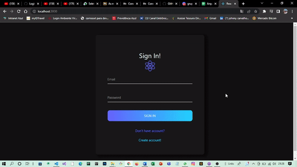

<h1 align="center">Login-Page-React</h1>

 
  
  
  
  

<h2>Descrição do projeto</h2>

Projeto desenvolvido em React com as tecnologias Java Script, HTML e CSS, sistema de login interativo.

------------------------------------------------------------------------------------------------------

<h1 
    align="center">Ilustração da aplicação funcionando no localhost3000
    
</h1>

